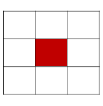

# This exercise is from Signals and Systems course in IUT

The purpose of this exercise is to gain a preliminary familiarity with the application of MATLAB software in signal processing, particularly concerning simple yet widely used concepts in the Signals and Systems course, especially when working with image signals. For this purpose, we consider a digital image(houses.bmp) as the input signal in this exercise.

### Digital Images as 2D Signals

A grayscale image is mathematically represented as a discrete two-dimensional function **f(m, n)**, where each coordinate pair (m, n) corresponds to a pixel. These images are typically obtained through:

- Sampling of analog images
- Direct capture by digital sensors (e.g., CCD arrays)

### Noise in Signal Processing

Noise refers to unwanted signal components that degrade image quality. Common manifestations include:

- Black/white specks (salt-and-pepper noise)
- Blurring effects
- Artifacts from various sources:
  - Handshake during capture
  - Limited device bandwidth
  - Shutter speed limitations
  - Sensor imperfections

The goal of denoising is to modify **f(m, n)** to minimize noise effects while preserving important image features.

### Part 1: One-Dimensional Mean Filtering

#### 1.1 Image Acquisition

- Read the `houses.bmp` image using `imread()`
- Convert pixel values from [0,255] to [0,1] range using `mat2gray()`
- Display the original image using `imshow()`

#### 1.2 Noise Generation

- Generate Gaussian noise with zero mean and unit variance using `randn()`
- Scale noise by factor **c** to achieve desired variance **c²**
- Add noise to the original image (c=0.2)
- Display and analyze the noisy image

#### 1.3 1D Mean Filter Implementation

- Implement an M-tap mean filter (M=7)
- Filter operates horizontally:
  **y(m, n) = (1/M) \* Σ x(m, n+k)** for k = -(M-1)/2 to (M-1)/2
- Apply filter using convolution with zero-padding for boundaries
- Analyze denoising effectiveness and filter causality

#### 1.4 Frequency Response Analysis

- Plot frequency response using `freqz()`
- Analyze passband/stopband characteristics
- Correlate frequency response with denoising performance

#### 1.5 Parameter Variation Study

- Compare filters with M=3 and M=15
- Visual assessment of denoising quality
- Frequency response comparison
- Edge preservation analysis

#### 1.6 Noise Intensity Analysis

- Test with different noise levels (varying **c**)
- Determine optimal filter order for different noise conditions
- Identify side effects of filter parameter selection

### Part 2: Two-Dimensional Mean Filtering

Filters more complex than those in Experiment 1 are filters that perform averaging in two dimensions. In other words, for each pixel, they take the average of the numbers related to its neighboring pixels and replace it (note that this filter is a special case of convolutional filters, which are very widely used in artificial intelligence networks).

For example, for a 3x3 window, the values of the pixels indicated in the figure below are averaged and replace the red pixel (note that in averaging over this window, the number of elements is MM, so after summation, the result must be divided by MM).



#### 2.1 2D Filter Implementation

- Implement 7×7 and 9×9 averaging filters
- Apply to noisy image (c=0.2)
- Compare results with 1D filtering approach
- Analyze boundary handling (zero-padding)

#### 2.2 Parameter Analysis

- Investigate interaction between window size (M) and noise level (c)
- Discuss denoising effectiveness vs. side effects
- Compare computational considerations

### Part 3: Differential Filtering

#### 3.1 Edge Detection

- Implement first-order difference filter:
  **y(m, n) = x(m, n) - x(m, n-1)**
- Apply to noise-free original image
- Analyze resulting edge enhancement

#### 3.2 Frequency Domain Analysis

- Plot frequency response of differential filter
- Characterize as high-pass filter
- Justify observed image effects through frequency analysis

## 📁 Exercise Structure

```
project/
├── images/
│   ├── houses.bmp
│   ├── part2_image
├── script/
│   ├── code_proj.m      # MATLAB code of 3 parts together
├── report/
│    └── outputs&analysis.pdf
├── README.md
```
